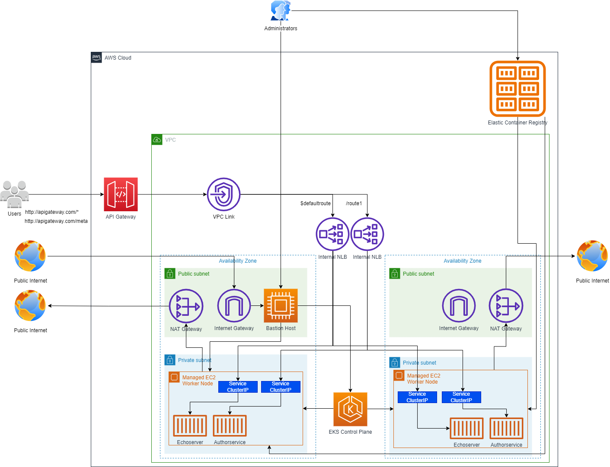

<!-- @format -->

# AWS EKS Cluster using terraform

AWS EKS cluster using terraform, AWS Controller for Kubernetes (ACK), and ELB Controlller for Kubernetes

<p align="center">
  <a href="#readme">
    
  </a>
</p>

## Prerequisites

1. [AWS CLI v2](https://docs.aws.amazon.com/cli/latest/userguide/getting-started-install.html)

2. [Terraform](https://developer.hashicorp.com/terraform/tutorials/aws-get-started/install-cli)

3. Login into your AWS account:

Here you have many options:

- AWS Access Key
- IAM user
- SSO

We recommend using IAM user or SSO because usually, when developers use Access Key method they create
the keys under the Root User profiles, what prevents limiting the access rights for the key (root user
cannot be used as the principal while assigning roles).

```
aws configure
```

or

```
aws configure sso
```

## Steps to create the cluster

- Create initial dependency selections that will initialize the dependency lock file (setting up providers).

```
terraform init
```

- Apply the terraform state

```
terraform apply -auto-approve
```

- Login into EC2 bastion host instance:

```
ssh -i "aws-terraform-key.pem" ec2-user@54.237.112.108
```

- From Bastion Instance, create an SSH connection to any EC2 node instance from the
  EKS cluster using the EKS cluster node instance private IP

```
ssh -i "/tmp/eks_nodes_keypair.pem" ec2-user@10.0.26.128
```

Then you should be able to access the EC2 instances from the EKS cluster using the
Bastion Host instance as a reverse proxy.

- To remove all the resources created, run the destroy command

```
terraform destroy --auto-approve
```

## Remarks

We are using **tls_private_key** to create a PEM (and OpenSSH) formatted private key. The private key generated by this resource will be stored unencrypted in your Terraform state file. Use of this resource for production deployments is not recommended. Instead, generate a private key file outside of Terraform and distribute it securely to the system where Terraform will be run.

## References

- [How to Create EKS Cluster Using Terraform](https://antonputra.com/terraform/how-to-create-eks-cluster-using-terraform/#create-nat-gateway-in-aws-using-terraform)

- [Creating and EKS cluster using Terraform](https://github.com/antonputra/tutorials/tree/vpc-simpleecommerce/lessons/102)

- [AWS Bastion Instance — Using Terraform Module](https://medium.com/cloud-native-daily/aws-bastion-instance-using-terraform-module-f5df2d309f98)

- [Creating a Bastion Host for Secure Access to Your AWS Infrastructure with Terraform](https://towardsaws.com/creating-a-bastion-host-for-secure-access-to-your-aws-infrastructure-with-terraform-17ee287bb3d)

- [Terraform | Create AWS EC2 instance with key-pair](https://awstip.com/terraform-create-aws-ec2-instance-with-key-pair-ff541f9eec58)

- [Elastic Container Registry (ECR)-Terraform](https://awstip.com/elastic-container-registry-ecr-terraform-d752753b6ac1)

- [Create an AWS API Gateway to your EKS Cluster (with Terraform)](https://medium.com/@alex067/create-an-aws-api-gateway-to-your-eks-cluster-with-terraform-46cdc91d9cea)
